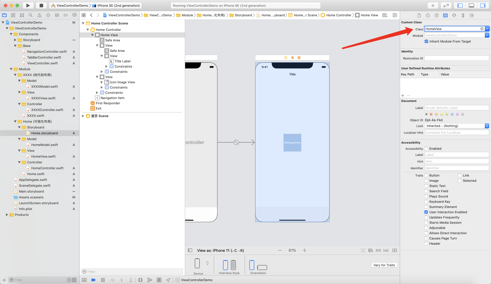
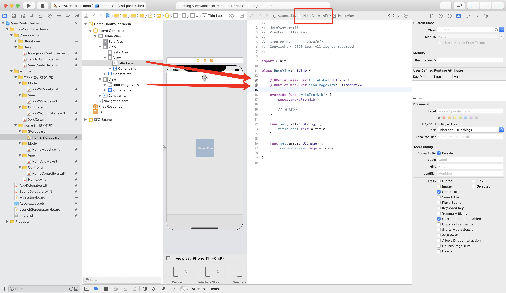
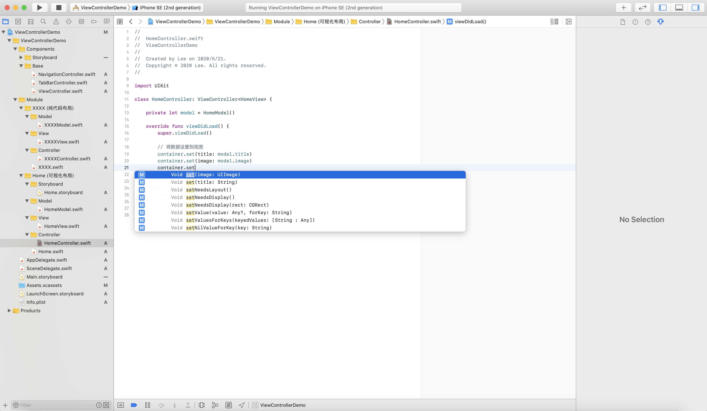

# 使用 Swift 泛型 优雅的进行UIViewController与View的分离


## MVC对于iOS开发的意义

对于iOS开发而言 始终无法绕开`UIKit`这个框架, 加之SwiftUI并不成熟, 所以你懂的, 而`UIKit`框架就是基于的MVC的设计模式, 所以这也是为什么MVC是苹果官方推荐的设计模式.

## 为什么我个人比较推荐项目中用MVC.

一. `官方推荐`这个标签肯定是有一定分量的.
二. 在一个基于MVC的框架上强行使用MVVM或MVP的设计模式, 不是不可以, 但总有些地方会差强人意, 当你使用各种知名框架时就会体会到这种感觉, 当然你可以选择忽略不计, 但它们确实存在.
三. 简单, 非常的简单, 没有学习成本, 是个开发者就懂, 基本没有"交流"障碍. 越简单越利于维护(这也是我比较推崇的开发风格 一切从简).
四. 可扩展性强, 因为足够通用, 所以在MVC基础上可以根据具体业务需要转变成其他设计模式, 总的来说 整个项目的基础设计模式还是MVC, 根据不同业务模块情况可以再使用最合适的设计模式.

## 老生常淡 MVC的最大弊端
没错 臃肿的C层代码.
所以很多优化方案都是围绕这点展开的, 咱们也不例外.

## UIViewController与UIView的纠葛
`UIViewController`在实际开发中会遇到很多问题, 这里我们只说View相关的问题.

按照苹果的设计理念:
 `UIViewController`对应`MVC`的`C`, `UIView`对应`MVC`的`V`, `XXXModel`对应`MVC`的`M`.

但尴尬的是 我们使用`UIViewController`时 不免会有很多View的处理在其中, 纯代码的方式还好一些, 可以通过封装自定义View类来解决, `Storyboard`和`Xib`的方式就尤为明显了.

___纯代码:___

自定义View类来编写视图相关的代码, 可以将V的处理从`UIViewController`中分离出去, 但是不免要在`UIViewController`中再次编写初始化 布局等代码. 试想每个`UIViewController`都要写一遍某个View的初始化 添加父视图 布局等.

___Storyboard或XIB:___

拖线链接的控件通常会在`UIViewController`中, 经常见到`UIViewController`中拖了一堆视图控件对象. 当然除了拖进来还要写一下其他视图相关的代码.
也有使用自定义View类来承载所有拖线链接的控件对象 和上面纯代码的方式差不多. 

___同样的困境:___
在`UIViewController`中view的类型永远都是`UIView`, 上面两种方式遇到的问题一样, 需要做类型转换才能访问到自定义View类中的属性和方法, 这无疑是很麻烦的.


## Swift 泛型优雅的解决类型转换问题

- 创建一个基类 (实际项目开发中应该要有一个`ViewController`基类, 并保证基类的干净, 这是一个很好的习惯)

```
class ViewController<Container: UIView>: UIViewController {

    var container: Container { view as! Container }
    
    override func loadView() {
        super.loadView()
        if view is Container {
            return
        }
        view = Container()
    }
}
```

- 所有视图控制器都继承自该基类, 并明确声明该控制器所使用的View类型

```
class HomeController: ViewController<HomeView> {

    override func viewDidLoad() {
        super.viewDidLoad()
        
    }
}
```

- 通过`container`属性直接访问上面声明的自定义View类型对象, 当然你也可以改为其他名字

```
class XXXXController: ViewController<XXXXView> {

    // CODE
  
    override func viewDidLoad() {
        super.viewDidLoad()
        // CODE
        container.xxxx()
    }
}
```

## 使用演示:

___纯代码:___

```
class XXXXView: UIView {

    private lazy var titleLabel = UILabel()
    private lazy var iconImageView = UIImageView()
    
    override init(frame: CGRect) {
        super.init(frame: frame)
        
        titleLabel.textColor = .black
        titleLabel.font = .systemFont(ofSize: 13, weight: .semibold)
        
        iconImageView.contentMode = .scaleAspectFill
        
        addSubview(titleLabel)
        addSubview(iconImageView)
    }
    
    required init?(coder: NSCoder) {
        fatalError("init(coder:) has not been implemented")
    }
    
    override func layoutSubviews() {
        super.layoutSubviews()
        
        titleLabel.frame = .init(x: 100, y: 100, width: 100, height: 40)
        iconImageView.frame = .init(x: 100, y: 100, width: 100, height: 100)
    }
    
    func set(title: String) {
        titleLabel.text = title
    }
    
    func set(image: UIImage) {
        iconImageView.image = image
    }
}
```

```
class XXXXController: ViewController<XXXXView> {

    private let model = XXXXModel()
    // CODE
  
    override func viewDidLoad() {
        super.viewDidLoad()
        // CODE
        container.set(title: model.title)
        container.set(image: model.image)
    }
}
```

```
let controller = XXXXController()
present(controller, animated: true)
```

___Storyboard或XIB:___

设置Controller类:


设置View类:



向View中拖线链接:



在Controller中为视图设置数据:




-----

## 总结

方法简单, 很好的解决了上面提到的这些问题, 使Controller与View的分离更加优雅.
```
class HomeController: ViewController<HomeView> { }
```
头部的声明可以直观的看到Controller的View类型, 可读性强.

因明确了类型 调用更加顺畅自然, 省去了多余的类型转换代码.

使 Controller 可以更专注于Model与View的协调和调用, 职责更明确.
